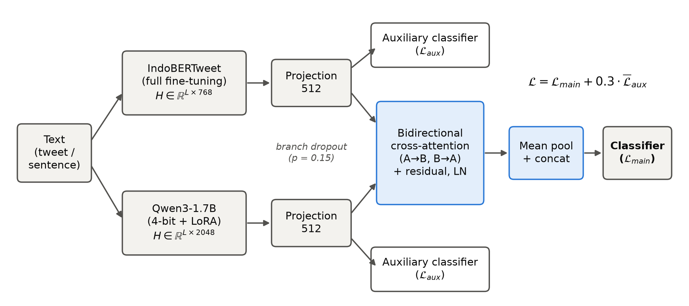
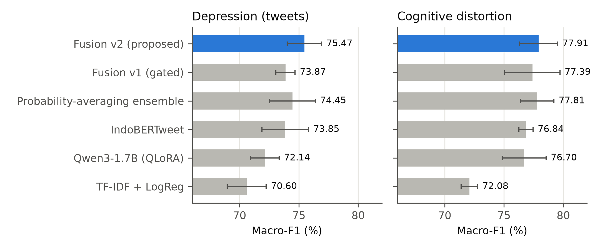

# IndoBERTweet × Qwen3 Cross-Attention Fusion

Code and experimental results for **"Cross-Attention Fusion of IndoBERTweet and Quantized Qwen3 for Detecting
Depression and Cognitive Distortion in Indonesian Text"** (manuscript under review).

The model fuses an Indonesian social-media encoder (IndoBERTweet) with a decoder LLM (Qwen3-1.7B, 4-bit QLoRA)
through token-level bidirectional cross-attention. Per-branch auxiliary losses and branch dropout keep both
branches in use. Everything trains on a free Kaggle session with 2 × T4 GPUs.



## Results

Macro-F1 (%), stratified 5-fold cross-validation, mean ± std. Full tables: `results/<task>/summary.md`.

| Model | Depression (tweets) | Cognitive distortion |
|---|---|---|
| TF-IDF + logistic regression | 70.60 ± 1.64 | 72.08 ± 0.70 |
| IndoBERTweet | 73.85 ± 1.97 | 76.84 ± 0.60 |
| Qwen3-1.7B (QLoRA) | 72.14 ± 1.21 | 76.70 ± 1.84 |
| Probability-averaging ensemble | 74.45 ± 1.94 | 77.81 ± 1.40 |
| Fusion v1 (softmax gate, ablation) | 73.87 ± 0.81 | 77.39 ± 2.32 |
| **Fusion v2 (proposed)** | **75.47 ± 1.45** | **77.91 ± 1.60** |

McNemar's test for Fusion v2 (depression / distortion): vs IndoBERTweet p = 0.018 / 0.058, vs Qwen3 p = 0.0001 /
0.028, vs ensemble p = 0.17 / 0.83, vs Fusion v1 p = 0.009 / 0.42. The gain over the ensemble is **not**
significant.



Fusion v1's softmax gate collapsed: per-fold gate weights jumped between ≈0 and ≈1, so the model only ever picked
one branch. Fusion v2 replaces the gate with concatenation and adds auxiliary losses and branch dropout.

## Datasets

The datasets are **not redistributed** in this repository. Download them from their sources into `data/raw/`
with the file names below.

| Task | Source | File name in `data/raw/` |
|---|---|---|
| `depresi` | [DatasetIndikasiDepresi](https://github.com/andrebudiman/DatasetIndikasiDepresi) (Budiman, 2021) | `budiman_depresi.csv` |
| `suicide` | [text-suicide-ideation-detection](https://github.com/apricitea/text-suicide-ideation-detection) | `apricitea_suicide.xlsx` |
| `depresi_anxiety` | [Depression and Anxiety in Twitter (ID)](https://www.kaggle.com/datasets/stevenhans/depression-and-anxiety-in-twitter-id) | `datd_train.csv`, `datd_test.csv` |
| `distortion`, `distortion_type` | Cognitive distortion dataset, Sastra et al., *Data in Brief* 61 (2025), [doi:10.1016/j.dib.2025.111836](https://doi.org/10.1016/j.dib.2025.111836) ([Mendeley](https://data.mendeley.com/datasets/k84bkv8dkt/4)) | `cognitive_distortion.csv` |
| `multiclass` | [CortiSoul](https://github.com/capstone-project-CortiSoul-CC26-PSU353/Data-Science-CortiSoul) (machine-translated) | `cortisoul_multiclass.csv` |

### Leakage handled by the preprocessing

- **Duplicates:** `depresi` has 10,082 rows but only ~3,874 unique texts. Duplicates and texts with conflicting
  labels are removed before splitting.
- **`$…$` span markers:** in `distortion`, these appear in 2,212 of 2,416 distorted texts but in only 9
  non-distorted ones, so they give the label away. They are stripped, and the back-translated augmentation rows
  are dropped.
- **`datd_rand`:** in the Kaggle depression–anxiety set, all 733 positives in `datd_rand` are identical to the
  training positives. The file is not used.

## Reproducing

```bash
pip install -r requirements.txt            # torch is preinstalled on Kaggle

python src/build_datasets.py               # data/raw/* -> data/raw_std/<task>.csv
python src/prepare_data.py --input data/raw_std/depresi.csv --out_dir data/depresi   # dedup + fixed 5 folds
python src/baselines.py --task depresi     # TF-IDF baselines (CPU)

# GPU (Kaggle T4 x2)
python src/train.py --task depresi --model encoder --run_name indobertweet
python src/train.py --task depresi --model llm --run_name qwen3_lora
python src/train.py --task depresi --model fusion --fusion cross_attention --run_name fusion_cross_v2 --no_grad_ckpt

python src/ensemble.py --task depresi --runs indobertweet qwen3_lora --name ensemble_avg
python src/aggregate.py --task depresi                                   # mean ± std table
python src/aggregate.py --task depresi --compare fusion_cross_v2 ensemble_avg   # McNemar + paired t-test
python src/figures.py --en && python src/analysis.py
```

`kaggle/experiments.py` runs a list of experiments on Kaggle and schedules two folds at a time, one per T4 GPU.
Folds that already have results are skipped, so a long plan can be split across sessions.

## Repository layout

```
src/
  build_datasets.py   raw sources -> text,label (fixes the leakage issues above)
  prepare_data.py     normalization, deduplication, stratified 5-fold split
  translate_dataset.py  optional EN->ID translation with NLLB-200
  baselines.py        TF-IDF + SVM / logistic regression / naive Bayes
  models.py           IndoBERTweet branch, Qwen3 QLoRA branch, fusion heads
  train.py            k-fold training, fp16, early stopping, saves predictions + probabilities
  ensemble.py         probability-averaging baseline
  aggregate.py        summary tables, per-class F1, McNemar's test
  figures.py, analysis.py   figures and error analysis
kaggle/               Kaggle kernel runners
results/<task>/<run>/foldK.json   metrics and test predictions (sample IDs only, no text)
```

## Notes

- Labels are text-based indications, not clinical diagnoses. The model is not a diagnostic tool.
- Each configuration was run with one seed. Quantized GPU training is not fully deterministic, so Qwen3 scores
  vary slightly between runs (`qwen3_lora_sesi1` vs `qwen3_lora`).

## License

The code in this repository is released under the [MIT License](LICENSE). The license does not cover the
datasets, which remain under the terms set by their original authors (see [Datasets](#datasets)).
